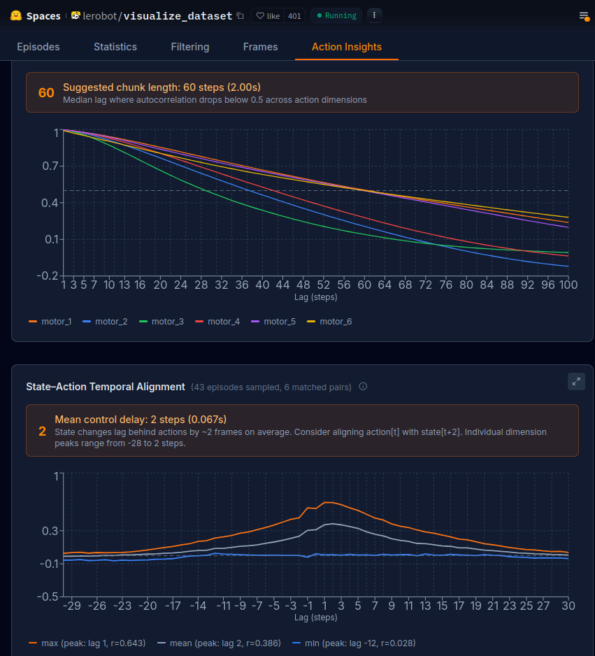

<div style="border: 2px solid gray; padding: 10px; border-radius: 5px; margin:10px;">
March (college reopen) - April 1 visit
</div>

---

# Install lerobot

- It's recommended to use `pip install -e .` for a more convenient file transfer.
- from - https://huggingface.co/docs/lerobot/installation
- https://www.mintlify.com/huggingface/lerobot/resources/troubleshooting

```bash
sudo chmod 666 /dev/ttyACM0 # add your user to dialout
# Most serial devices (/dev/ttyACM*) belong to the dialout group.
sudo usermod -aG dialout $USER
newgrp dialout # (log out and log back in)
ls -l /dev/ttyACM0 # Verify
# You should see something like:
# crw-rw---- 1 root dialout ...
```

```bash
# to check whether editable or pypi download
python -c "import lerobot; print(lerobot.__file__)"
pip show lerobot
```

---

# Lerobot Installation Confirm

```
(lerobot)$ lerobot-info
- LeRobot version: 0.4.4
- Platform: Linux-6.17.0-19-generic-x86_64-with-glibc2.39
- Python version: 3.12.13
- Huggingface Hub version: 0.35.3
- Datasets version: 4.6.1
- Numpy version: 2.3.5
- FFmpeg version: 6.1.1-3ubuntu5
- PyTorch version: 2.10.0+cu128
- Is PyTorch built with CUDA support?: True
- Cuda version: 12.8
- GPU model: NVIDIA GeForce RTX 2050
- Using GPU in script?: <fill in>
- lerobot scripts: ['lerobot-calibrate', 'lerobot-dataset-viz', 'lerobot-edit-dataset', 'lerobot-eval', 'lerobot-find-cameras', 'lerobot-find-joint-limits', 'lerobot-find-port', 'lerobot-imgtransform-viz', 'lerobot-info', 'lerobot-record', 'lerobot-replay', 'lerobot-setup-can', 'lerobot-setup-motors', 'lerobot-teleoperate', 'lerobot-train', 'lerobot-train-tokenizer']
```

---

# Trying teleoperate

```bash
lerobot-teleoperate \
--robot.type=so100_follower \
--robot.port=/dev/ttyACM0 \
--robot.id=so100_follower \
--teleop.type=keyboard \
```

> Calibration saved to `/home/srirama/.cache/huggingface/lerobot/calibration/robots/so_follower/so100_follower.json`
> ⚠️ Does not work — teleoperate (same error `IterationError(models)`)

```bash
lerobot-teleoperate \
--robot.type=so100_follower \
--robot.port=/dev/ttyACM0 \
--robot.id=so100_follower \
--teleop.type=gamepad \
--robot.calibration_dir ~/.cache/huggingface/lerobot/calibration/robots/so_follower
```

---

# Install Poetry for telerobot

- https://github.com/vladfatu/telerobot

```bash
echo 'export PATH="$HOME/.local/bin:$PATH"' >> ~/.bashrc
source ~/.bashrc
```

> **⚠️ Keyring Problem**

```bash
echo 'export PYTHON_KEYRING_BACKEND=keyring.backends.null.Keyring' >> ~/.bashrc
source ~/.bashrc
poetry install -vvv  # for verbose-detail output
```

---

# XLerobot

## for teleoperation - keyboard

- Properly follow https://xlerobot.readthedocs.io/en/latest/software/getting_started/install.html for installation
- Script: `0_so100_keyboard_joint_control.py`

```
Robot has moved to zero position
Keyboard control instructions:
- Q/A: Joint1 (shoulder_pan) decrease/increase
- W/S: Joint2 (shoulder_lift) decrease/increase
- E/D: Joint3 (elbow_flex) decrease/increase
- R/F: Joint4 (wrist_flex) decrease/increase
- T/G: Joint5 (wrist_roll) decrease/increase
- Y/H: Joint6 (gripper) decrease/increase
- X: Exit program (first return to start position)
- ESC: Exit program
```

## for YOLO based detection

```bash
# camera permissions
ls -l /dev/video2
sudo usermod -aG video $USER

micromamba remove opencv
pip uninstall opencv-python opencv-python-headless -y

# needed for GUI support in ubuntu
sudo apt update
sudo apt install -y libgtk-3-0 libgtk-3-dev pkg-config
micromamba install -c conda-forge opencv
pip install opencv-python
```

---

# lerobot-train

Also look into this folder: `~/RoboticArm/lerobot/src/lerobot/policies`
Using dataset - https://huggingface.co/datasets/Sri-Ram-A/pnp1

## ACT policy

- To get hyperparameters → `lerobot-train --policy.type=act --help`
- Config: `~RoboticArm/lerobot/src/lerobot/policies/act/configuration_act.py`
- Go to `lerobot/visualize_dataset` and check **Action Insights** tab
- Look into https://huggingface.co/docs/lerobot/act for other parameters



- https://colab.research.google.com/github/huggingface/notebooks/blob/main/lerobot/training-act.ipynb
- **HF TOKEN** `lerobot-ubuntu` with WRITE permission: `hf_frV...`

```python
import os
os.environ["HF_TOKEN"] = "hf_frV..."
os.environ["HF_USER"] = "Sri-Ram-A"
hf_token = os.getenv("HF_TOKEN")
hf_user = os.getenv("HF_USER")
print("HF_TOKEN:", hf_token)
print("HF_USER:", hf_user)
```

```bash
!lerobot-train \
  --dataset.repo_id=Sri-Ram-A/pnp1 \
  --dataset.revision=v3.0 \
  --policy.type=act \
  --output_dir=outputs/act \
  --policy.chunk_size=60 \
  --policy.n_action_steps=30 \
  --policy.n_encoder_layers=4 \
  --policy.n_decoder_layers=1 \
  --policy.use_vae=true \
  --policy.device=cuda \
  --policy.kl_weight=10.0 \
  --job_name=act_pnp1 \
  --steps=100000 \
  --batch_size=8 \
  --policy.repo_id=Sri-Ram-A/act_pnp1
```

> **Claude AI:** If loss doesn't drop below **0.3** by step **50,000**, your data quality is the issue (the jerkiness), not the hyperparameters.

### Errors & Fixes

```bash
huggingface_hub.errors.RevisionNotFoundError: Your dataset must be tagged with a codebase version.
Assuming _version_ is the codebase_version value in the info.json, you can run this:
```

```python
from huggingface_hub import HfApi
hub_api = HfApi()
hub_api.create_tag("Sri-Ram-A/pnp1", tag="v1.0", repo_type="dataset")
```

```bash
File "/home/srirama/micromamba/envs/lerobot/lib/python3.12/site-packages/lerobotdatasets/utils.py", line 557, in get_safe_version
  raise BackwardCompatibilityError(repo_id, max(lower_major))
        ^^^^^^^^^^^^^^^^^^^^^^^^^^^^^^^^^^^^^^^^^^^^^^^^^^^^^
File "/home/srirama/micromamba/envs/lerobot/lib/python3.12/site-packages/lerobotdatasets/backward_compatibility.py", line 47, in __init__
  raise NotImplementedError(
NotImplementedError: Contact the maintainer on [Discord](https://discord.com/invite/s3KuuzsPFb).
```

```python
# Check hf dataset version
from huggingface_hub import hf_hub_download
import json
f = hf_hub_download('Sri-Ram-A/pnp1', 'meta/info.json', repo_type='dataset')
print(json.load(open(f)))
```

```python
# Step 1: Download from main branch manually
from huggingface_hub import snapshot_download
snapshot_download(
    'Sri-Ram-A/pnp1',
    repo_type='dataset',
    revision='main',
    local_dir='/home/srirama/.cache/huggingface/lerobot/Sri-Ram-A/pnp1'
)
print('Done!')
```

```bash
# Step 2: Now convert using --root (skips hub download, uses local copy)
python -m lerobot.scripts.convert_dataset_v21_to_v30 \
  --repo-id Sri-Ram-A/pnp1 \
  --root ~/.cache/huggingface/lerobot/Sri-Ram-A/pnp1 \
  --branch main \
  --push-to-hub True \
  --force-conversion
```

### Kaggle Training

- https://www.kaggle.com/code/sriram1k/act-pnp1
- Took **8h 58m 13s** · GPU T4 x2 Runtime

```bash
pip install kaggle
# Authenticate - https://github.com/Kaggle/kaggle-cli/blob/main/docs/README.md#authentication
export KAGGLE_API_TOKEN=KGAT_ee... # Copied from the settings UI (https://www.kaggle.com/settings)
kaggle kernels output sriram1k/act-pnp1 -p ~/Documents/sr_proj/RoboticArm/models
```

---

## SmolVLA policy fine-tuning

- https://github.com/huggingface/notebooks/blob/main/lerobot/training-smolvla.ipynb
- Take care of above steps also
- https://medium.com/correll-lab/fine-tuning-smolvla-for-new-environments-code-included-af266c56d632 for understanding hyperparameters

```bash
pip install "lerobot[smolvla]"
```

```bash
!lerobot-train \
  --dataset.repo_id Sri-Ram-A/pnp1 \
  --dataset.revision v3.0 \
  --policy.repo_id Sri-Ram-A/smolvla_pnp1 \
  --policy.type smolvla \
  --policy.pretrained_path HuggingFaceVLA/smolvla_libero \
  --policy.expert_width_multiplier 0.5 \
  --policy.num_vlm_layers 0 \
  --policy.vlm_model_name HuggingFaceTB/SmolVLM2-500M-Instruct \
  --output_dir outputs/smolvla \
  --job_name smolvla_pnp1 \
  --batch_size 16 \
  --steps 9000 \
  --optimizer.lr 1e-5 \
  --num_workers 4 \
  --save_freq 1000 \
  --eval_freq 900 \
  --wandb.enable false \
  --policy.push_to_hub true \
  --save_checkpoint true
```

# Inference using async 
- https://huggingface.co/docs/lerobot/async
```bash
pip install -e ".[async]"
# This will start a policy server listening on 127.0.0.1:8080 (localhost, port 8080). At this stage, the policy server is empty, as all information related to which policy to run and with which parameters are specified during the first handshake with the client. 
(lerobot) boston@boston:~/lerobot/src$ \
python -m lerobot.async_inference.policy_server \
  --host=0.0.0.0 \
  --port=8080
INFO 2026-03-31 13:11:40 y_server.py:420 {'fps': 30,
 'host': '0.0.0.0',
 'inference_latency': 0.03333333333333333,
 'obs_queue_timeout': 2,
 'port': 8080}
INFO 2026-03-31 13:11:40 y_server.py:430 PolicyServer started on 0.0.0.0:8080


hostname -I
# 172.16.2.131 10.44.44.1 10.44.44.129 10.200.0.1 10.201.0.1 
# Spin up a client with:

python -m lerobot.async_inference.robot_client \
    --server_address=172.16.2.131:8080 \ # SERVER: the host address and port of the policy server
    --robot.type=so100_follower \ # ROBOT: your robot type
    --robot.port=/dev/ttyACM0 \ # ROBOT: your robot port
    --robot.id=so100_follower \ # ROBOT: your robot id, to load calibration file
    --robot.cameras="{ laptop: {type: opencv, index_or_path: 0, width: 1920, height: 1080, fps: 30}, phone: {type: opencv, index_or_path: 0, width: 1920, height: 1080, fps: 30}}" \ # POLICY: the cameras used to acquire frames, with **keys** matching the keys expected by the policy
    --task="Pick up the yellow cuboid" \ # POLICY: The task to run the policy on (`Fold my t-shirt`). Not necessarily defined for all policies, such as `act`
    --policy_type=act \ # POLICY: the type of policy to run (smolvla, act, etc)
    --pretrained_name_or_path=Sri-Ram-A/act_pnp1 \ # POLICY: the model name/path on server to the checkpoint to run (e.g., lerobot/smolvla_base)
    --policy_device=cpu \ # POLICY: the device to run the policy on, on the server (cuda, mps, xpu, cpu)
    --actions_per_chunk=60 \ # POLICY: the number of actions to output at once
    --chunk_size_threshold=0.5 \ # CLIENT: the threshold for the chunk size before sending a new observation to the server
    --aggregate_fn_name=weighted_average \ # CLIENT: the function to aggregate actions on overlapping portions
    --debug_visualize_queue_size=True # CLIENT: whether to visualize the queue size at runtime


python -m lerobot.async_inference.robot_client \
  --server_address=172.16.2.131:8080 \
  --robot.type=so100_follower \
  --robot.port=/dev/ttyACM0 \
  --robot.id=so100_follower \
  --robot.cameras='{
    "secondary_0": {"type": "opencv", "index_or_path": "/dev/video2", "width": 640, "height": 480, "fps": 30},
    "main": {"type": "opencv", "index_or_path": "/dev/video4", "width": 640, "height": 480, "fps": 30}
  }' \
  --task="Pick up the yellow cuboid" \
  --policy_type=act \
  --pretrained_name_or_path=Sri-Ram-A/act_pnp1 \
  --policy_device=cpu \
  --actions_per_chunk=60 \
  --chunk_size_threshold=0.3 \
  --aggregate_fn_name=weighted_average \
  --debug_visualize_queue_size=True
  # --robot.use_degrees=false
  
```

lerobot-record \
  --robot.type=so100_follower \
  --robot.port=/dev/ttyACM0 \
  --robot.id=so100_follower \
  --robot.cameras='{
    "secondary_0": {"type": "opencv", "index_or_path": "/dev/video2", "width": 640, "height": 480, "fps": 30},
    "main": {"type": "opencv", "index_or_path": "/dev/video4", "width": 640, "height": 480, "fps": 30}
  }' \
  --display_data=true \
  --dataset.repo_id=${HF_USER}/eval_pnp1 \
  --dataset.num_episodes=10 \
  --dataset.single_task="Pick up the yellow cuboid" \
  --dataset.streaming_encoding=true \
  --dataset.encoder_threads=2 \
  --policy.path=Sri-Ram-A/act_pnp1

lerobot-record \
  --robot.type=so100_follower \
  --robot.port=/dev/ttyACM0 \
  --robot.id=so100_follower \
  --robot.cameras='{
    "secondary_0": {"type": "opencv", "index_or_path": "/dev/video2", "width": 640, "height": 480, "fps": 30},
    "main": {"type": "opencv", "index_or_path": "/dev/video4", "width": 640, "height": 480, "fps": 30}
  }' \
  --display_data=true \
  --dataset.repo_id=${HF_USER}/eval_pnp1 \
  --dataset.num_episodes=10 \
  --dataset.single_task="Pick up the yellow cuboid" \
  --dataset.streaming_encoding=true \
  --dataset.encoder_threads=2 \
  --policy.path=Sri-Ram-A/act_pnp1 \
  --dataset.video=false

rm -rf ~/.cache/huggingface/lerobot/Sri-Ram-A/eval_pnp1


