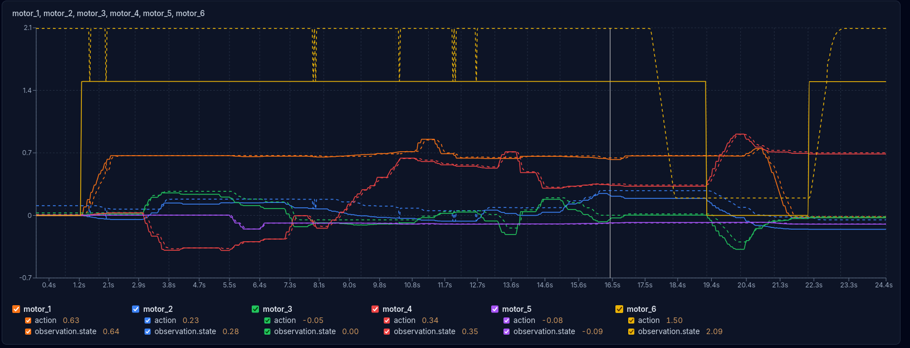
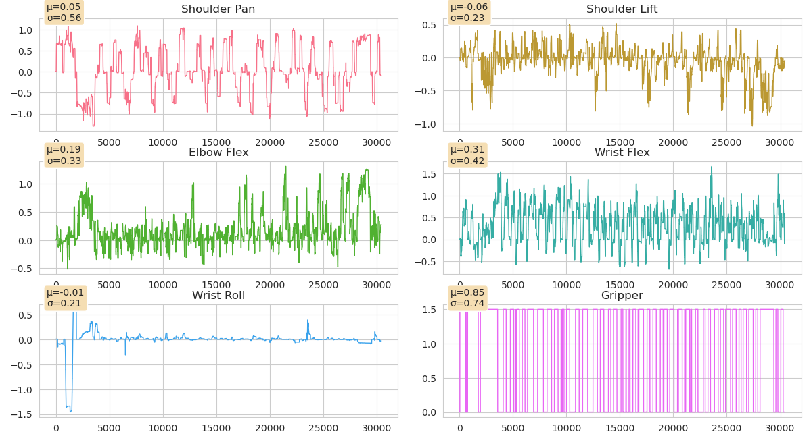

****
# April 1st - Marelli didnt visit

## Playing with robot
- Looking at the motor labels I have - Feetech
- I am able to control motor using only degrees (tests/1_motor_testing.py)
- I was playing around with : ~/RoboticArm/lerobot/src/lerobot/robots/so_follower/__init__.py 
- Clearly understood working of motors with degress :
(".pos" must be appended with the motor_ids in the action dictionary for motor to move using any degree). Understood How SO100Follower is implemented using dracas library for dataclasses
- Now,plaing with the recorded dataset to understand s.
- ome stats 

## Playing with dataset
- Dataset is Sri-Ram-A/pnp1 from hugging face
- Running in Interactive terminal of VSCode : ~/RoboticArm/tests/2_dataset.py
- 
- Below conclusions and outputs are in : ~/RoboticArm/tests/2_dataset.py
  - Actions in dataset are in radians 
  - Both The Camera Images are normalised 
  - Look at 

- The model outputs Normalised actions , which must be denormalised and then converted to degrees 
- Camera footage is internally normalised
  
# Trying to run inference
- https://www.mintlify.com/huggingface/lerobot/installation
pip install lerobot[damiao]
sudo apt install v4l-utils

(lerobot) ~/Documents/sr_proj/RoboticArm$ v4l2-ctl -d /dev/video2 --get-fmt-video
Format Video Capture:
        Width/Height      : 1920/1080
        Pixel Format      : 'YUYV' (YUYV 4:2:2)
        Field             : None
        Bytes per Line    : 3840
        Size Image        : 4147200
        Colorspace        : sRGB
        Transfer Function : Rec. 709
        YCbCr/HSV Encoding: ITU-R 601
        Quantization      : Default (maps to Limited Range)
        Flags             : 

# Camera backend issue
- https://discuss.huggingface.co/t/lerobot-camera-backend-issues/173200?utm_source=chatgpt.com
pip uninstall opencv-python opencv-python-headless opencv-contrib-python -y
Do this:
micromamba remove opencv -y
micromamba install -c conda-forge opencv=4.12 -y
Then verify:
python -c "import cv2; print(cv2.__version__)" # 4.12.0


# New updates
- using minlify many changes in dataset statistics and stuff
- currrently done till 9_record_dataset.py and working on 11_train_act.py

# Model is just jittering therefore looking for all causes
- https://medium.com/@rahil.lasne/why-your-robot-policy-doesnt-work-and-how-to-find-out-in-30-seconds-43d3beb65888

pip install orbit-robotics
orbit analyze /home/srirama/Documents/sr_proj/RoboticArm/datasets/so100_keyboard_teleop_4 --policy act

- Start every episode with the robot in the SAME home position
- Always approach the object from the SAME side (e.g., always from the right) Contradictory Demonstrations
- Always use the SAME grasp type (top pinch vs side grasp)
- Always move at SIMILAR speeds
- The robot learns the average of what you show it—if you show multiple strategies, the average fails
- End when the object is placed—no extra idle time (that teaches the robot to linger) 
- Ensure Camera is RGB and task is 1 or 2 words
- Delete incomplete episodes (like your Episodes 4 and 5 at 33-40% completion)
- Keep episode lengths consistent (CV should be under 0.3)
- 50+ episodes minimum for ACT 


export HF_USER=Sri-Ram-A

rm -rf ~/.cache/huggingface/lerobot/Sri-Ram-A/lerobot_testing

# Recording predefined episodes 
lerobot-record \
  --robot.type=so100_follower \
  --robot.port=/dev/ttyACM0 \
  --robot.id=so100_follower \
  --robot.cameras='{
    "secondary_0": {"type": "opencv", "index_or_path": "/dev/video2", "width": 640, "height": 480, "fps": 30},
    "main": {"type": "opencv", "index_or_path": "/dev/video4", "width": 640, "height": 480, "fps": 30}
  }' \
  --teleop.type=keyboard \
  --teleop.step_deg=2.0 \
  --display_data=true \
  --dataset.single_task="Pick cuboid" \
  --dataset.repo_id=${HF_USER}/lerobot_testing \
  --dataset.num_episodes=5 \
  --dataset.episode_time_s=10 \
  --dataset.reset_time_s=10 \
  --dataset.push_to_hub=true
  
# Resuming Dataset Recording
lerobot-record \
  --robot.type=so100_follower \
  --robot.port=/dev/ttyACM0 \
  --robot.id=so100_follower \
  --robot.cameras='{
    "secondary_0": {"type": "opencv", "index_or_path": "/dev/video2", "width": 640, "height": 480, "fps": 30},
    "main": {"type": "opencv", "index_or_path": "/dev/video4", "width": 640, "height": 480, "fps": 30}
  }' \
  --teleop.type=keyboard \
  --teleop.step_deg=2.0 \
  --display_data=true \
  --dataset.single_task="Pick cuboid" \
  --dataset.repo_id=${HF_USER}/lerobot_testing \
  --dataset.root=~/.cache/huggingface/lerobot \
  --dataset.num_episodes=50 \
  --dataset.episode_time_s=30 \
  --dataset.reset_time_s=10 \
  --dataset.push_to_hub=true \
  --resume=true


lerobot-record \
--robot.type=so100_follower \
--robot.port=/dev/ttyACM0 \
--robot.id=so100_follower \
--robot.cameras='{
  "secondary_0": {"type": "opencv", "index_or_path": "/dev/video2", "width": 640,"height": 480, "fps": 30},
  "main": {"type": "opencv", "index_or_path": "/dev/video4", "width": 640, "height":480, "fps": 30}
}' \
--teleop.type=keyboard \
--teleop.step_deg=2.0 \
--display_data=true \
--dataset.single_task="Pick cuboid" \
--dataset.repo_id=${HF_USER}/second_final \
--dataset.num_episodes=50 \
--dataset.episode_time_s=45 \
--dataset.reset_time_s=10 \
--dataset.push_to_hub=true \
--resume=true \
--dataset.root=$HOME/.cache/huggingface/lerobot


import pyarrow.parquet as pq
from huggingface_hub import HfApi
import os

cache_dir = os.path.expanduser("~/.cache/huggingface/lerobot/meta/episodes/chunk-000")
f000 = f"{cache_dir}/file-000.parquet"
f001 = f"{cache_dir}/file-001.parquet"

good = pq.read_table(f000)
bad  = pq.read_table(f001)

print("file-000 columns:", good.schema.names[:4], "...")
print("file-001 columns:", bad.schema.names[:4], "...")

fixed = bad.select(good.schema.names)
pq.write_table(fixed, f001)
print("Fixed file-001.parquet written locally.")

# Upload to Hub
api = HfApi()
repo_id = f"{os.environ['HF_USER']}/first_final"
api.upload_file(
    path_or_fileobj=f001,
    path_in_repo="meta/episodes/chunk-000/file-001.parquet",
    repo_id=repo_id,
    repo_type="dataset",
)
print(f"Uploaded fixed file to {repo_id}")
! hf upload Sri-Ram-A/final_third ~/.cache/huggingface/lerobot/Sri-Ram-A/final_third . --repo-type dataset
>>> from huggingface_hub import upload_folder
>>> upload_folder(
...     folder_path="~/.cache/huggingface/lerobot/Sri-Ram-A/final_third", # Path to your dataset folder
...     repo_id="Sri-Ram-A/final_third",    # Your existing repo ID
...     repo_type="dataset",
...     commit_message="Upload dataset from local laptop"
... )
Processing Files (8 / 8)      : 100%|████████████|  517MB /  517MB, 6.44MB/s  
New Data Upload               : |                |  0.00B /  0.00B,  0.00B/s  
  ..._third/meta/tasks.parquet: 100%|████████████| 2.04kB / 2.04kB            
  ...hunk-000/file-000.parquet: 100%|████████████|  215kB /  215kB            
  ...hunk-000/file-000.parquet: 100%|████████████|  854kB /  854kB            
  ...mages.secondary_0_045.mp4: 100%|████████████| 5.47MB / 5.47MB            
  ...ation.images.main_045.mp4: 100%|████████████| 10.5MB / 10.5MB            
  ...in/chunk-000/file-001.mp4: 100%|████████████|  110MB /  110MB            
  ..._0/chunk-000/file-000.mp4: 100%|████████████|  180MB /  180MB            
  ...in/chunk-000/file-000.mp4: 100%|████████████|  210MB /  210MB            
No files have been modified since last commit. Skipping to prevent empty commit.
CommitInfo(commit_url='https://huggingface.co/datasets/Sri-Ram-A/final_third/commit/da9811f56630c4385dda0d0a067079c62445b570', commit_message='Upload dataset from local laptop', commit_description='', oid='da9811f56630c4385dda0d0a067079c62445b570', pr_url=None, repo_url=RepoUrl('https://huggingface.co/datasets/Sri-Ram-A/final_third', endpoint='https://huggingface.co', repo_type='dataset', repo_id='Sri-Ram-A/final_third'), pr_revision=None, pr_num=None)


from lerobot.datasets.lerobot_dataset import LeRobotDataset
dataset = LeRobotDataset(
    repo_id="Sri-Ram-A/final_third",
    force_cache_sync=True,
    revision="main"
)

!lerobot-train \
  --dataset.repo_id=Sri-Ram-A/final_third \
  --dataset.revision=main \
  --job_name=act_final_third \
  --policy.type=act \
  --batch_size=16 \
  --steps=100000 \
  --policy.chunk_size=58 \
  --policy.n_action_steps=20 \
  --log_freq=200 \
  --save_freq=20000 \
  --eval_freq=20000 \
  --policy.device=cuda \
  --output_dir=outputs/train/act_final_third \
  --dataset.image_transforms.enable=true \
  --dataset.image_transforms.random_order=true \
  --policy.repo_id=Sri-Ram-A/act_final_third \
  --wandb.enable=true


  # Inference
lerobot-record \
--robot.type=so100_follower \
--robot.port=/dev/ttyACM0 \
--robot.id=so100_follower \
--robot.cameras='{
  "secondary_0": {"type":"opencv","index_or_path":"/dev/video2","width":640,"height":480,"fps":30},
  "main": {"type":"opencv","index_or_path":"/dev/video4","width":640,"height":480,"fps":30}
}' \
--display_data=true \
--dataset.single_task="Pick cuboid" \
--dataset.repo_id=Sri-Ram-A/eval_act_final_third \
--dataset.num_episodes=10 \
--policy.path=Sri-Ram-A/act_final_third


rm -rf ~/.cache/huggingface/lerobot/Sri-Ram-A/eval_act_final_third 


# Inference using async 
- https://huggingface.co/docs/lerobot/async
```bash
pip install -e ".[async]"
# This will start a policy server listening on 127.0.0.1:8080 (localhost, port 8080). At this stage, the policy server is empty, as all information related to which policy to run and with which parameters are specified during the first handshake with the client. 
(lerobot) boston@boston:~/lerobot/src$ \
python -m lerobot.async_inference.policy_server \
  --host=0.0.0.0 \
  --port=8080
INFO 2026-03-31 13:11:40 y_server.py:420 {'fps': 30,
 'host': '0.0.0.0',
 'inference_latency': 0.03333333333333333,
 'obs_queue_timeout': 2,
 'port': 8080}
INFO 2026-03-31 13:11:40 y_server.py:430 PolicyServer started on 0.0.0.0:8080


hostname -I
# 172.16.2.131 10.44.44.1 10.44.44.129 10.200.0.1 10.201.0.1 
# Spin up a client with:

python -m lerobot.async_inference.robot_client \
  --server_address=172.16.2.131:8080 \
  --robot.type=so100_follower \
  --robot.port=/dev/ttyACM0 \
  --robot.id=so100_follower \
  --robot.cameras='{
    "secondary_0": {
      "type":"opencv",
      "index_or_path":"/dev/video4",
      "width":640,
      "height":480,
      "fps":30
    },
    "main": {
      "type":"opencv",
      "index_or_path":"/dev/video2",
      "width":640,
      "height":480,
      "fps":30
    }
  }' \
  --task="Pick cuboid" \
  --policy_type=act \
  --pretrained_name_or_path=Sri-Ram-A/act_final_third \
  --policy_device=cpu \
  --actions_per_chunk=58 \
  --chunk_size_threshold=0.5 \
  --aggregate_fn_name=weighted_average \
  --debug_visualize_queue_size=True
  
```

lerobot-calibrate \
  --robot.type=so100_follower \
  --robot.port=/dev/ttyACM0 \
  --robot.id=so100_follower